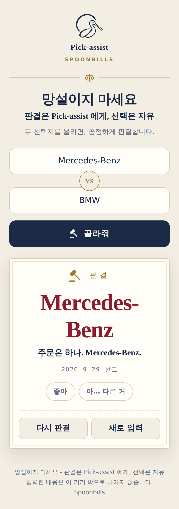
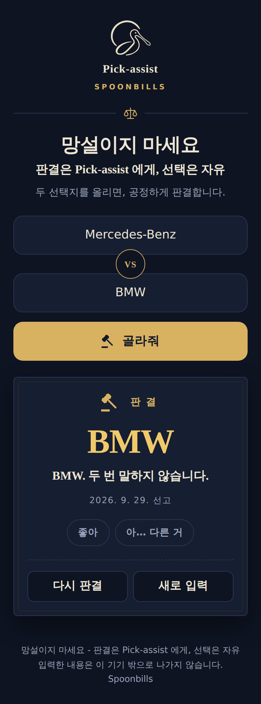

# Pick-assist

**Can't decide between two things? Type them in, press one button, and get a firm answer.**

Pick-assist is a tiny web tool from Spoonbills' "~assist" family
(Workflow-assist, Densi-assist, Stat-assist). It picks one of two options with a
fair 50:50 draw and hands down the verdict without hesitation.
Don't hesitate — leave the verdict to Pick-assist; the choice is still yours.

<p>
  
  
</p>

**Demo:** https://rundope.github.io/Pick-assist/

## How to use

1. Type one option in each field, e.g. `Mercedes-Benz` and `BMW`.
   Enter in the first field jumps to the second. Pasting `Mercedes-Benz vs BMW` into one field
   also works (separators: `vs`, `VS`, `Vs`, `/`, `아니면`, `or`).
2. Press **골라줘** (or hit Enter). After a short gavel swing, you get the verdict and one decisive line.
3. Optionally react with **좋아** or **아… 다른 거**. If you wanted the other one,
   the answer was already in you — go with it.
4. Press **다시 판결** to draw again with the same options, or **새로 입력** to start over.

## Promises

- **Fair.** Every draw is an exact 50:50 using `crypto.getRandomValues()`. No weights, no tricks.
- **Private.** No server, no login, no storage, no analytics. A Content-Security-Policy
  blocks every outbound request, so what you type never leaves your device.
- **Careful.** Health and safety decisions (medication, stopping treatment, surgery, …)
  are not drawn; you are asked to consult a professional. Self-harm related input shows
  the Korean suicide prevention hotline **109** instead of a draw.

## Development

Everything lives in `index.html` — plain HTML, CSS, and JavaScript with no build step
and no npm dependencies. Open the file in a browser to run it.

```sh
node --test tests/*.test.js   # Node.js 18+
```

## License

[MIT](LICENSE) © 2026 Spoonbills

---

# Pick-assist (한국어)

**둘 중에 망설여질 때, 입력하고 버튼 하나 누르면 단호하게 골라 드립니다.**

Pick-assist는 Spoonbills의 "~assist" 제품군(Workflow-assist, Densi-assist,
Stat-assist) 중 하나인 작은 웹 도구입니다. 두 선택지 중 하나를 공정한 50:50으로
고르고, 망설임 없이 판결합니다.
망설이지 마세요 - 판결은 Pick-assist 에게, 선택은 자유.

<p>
  
  
</p>

**데모:** https://rundope.github.io/Pick-assist/

## 사용법

1. 두 입력칸에 선택지를 하나씩 적습니다. 예: `Mercedes-Benz`, `BMW`
   첫 칸에서 Enter를 치면 둘째 칸으로 넘어갑니다. 한 칸에 `Mercedes-Benz vs BMW`처럼 붙여 넣어도
   알아서 나눕니다 (구분자: `vs`, `VS`, `Vs`, `/`, `아니면`, `or`).
2. **골라줘**를 누르거나 Enter를 칩니다. 의사봉 연출 뒤에 판결과 단호한 한 문장이 나옵니다.
3. 원하면 **좋아** 또는 **아… 다른 거**를 누릅니다. 다른 쪽이 아쉬웠다면
   답은 이미 정해져 있었던 겁니다. 그쪽으로 가세요.
4. **다시 판결**은 같은 선택지로 다시 고르고, **새로 입력**은 처음부터 시작합니다.

## 약속

- **공정합니다.** 모든 추첨은 `crypto.getRandomValues()`를 쓰는 정확한 50:50입니다. 가중치나 조작이 없습니다.
- **입력이 밖으로 나가지 않습니다.** 서버·로그인·저장·분석 도구가 없습니다.
  Content-Security-Policy가 외부 요청을 모두 막습니다.
- **조심합니다.** 약 복용·치료 중단·수술 같은 건강·안전 결정은 추첨하지 않고
  전문가와 상의하도록 안내합니다. 자해·자살 관련 입력에는 추첨 대신
  자살예방 상담전화 **109**를 안내합니다.

## 개발

앱 전체가 `index.html` 한 파일입니다. 순수 HTML·CSS·JavaScript이며 빌드 단계와
npm 의존성이 없습니다. 브라우저로 파일을 열면 바로 동작합니다.

```sh
node --test tests/*.test.js   # Node.js 18 이상
```

## 라이선스

[MIT](LICENSE) © 2026 Spoonbills
