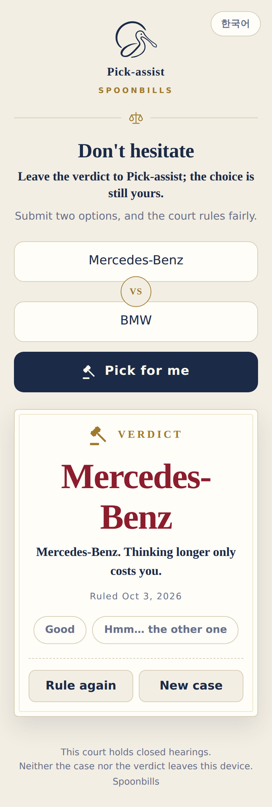
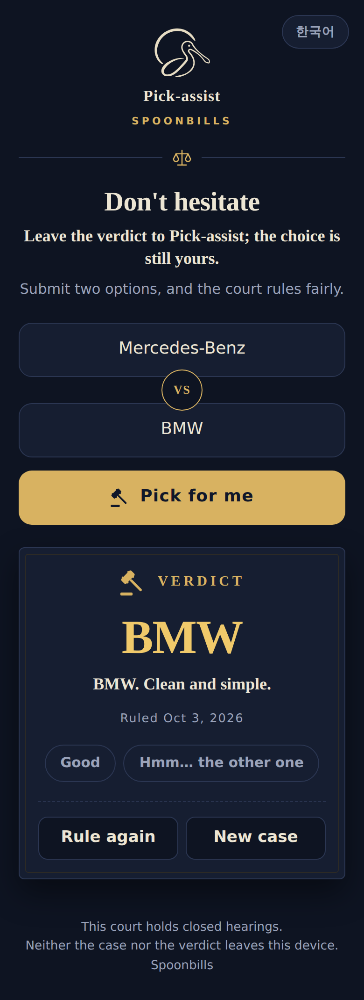
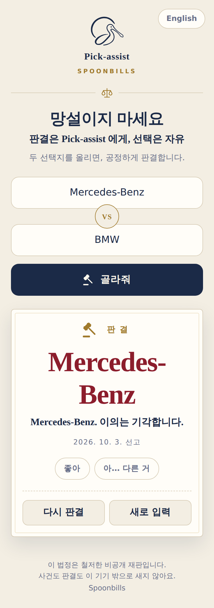
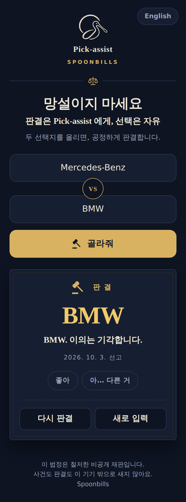

# Pick-assist

[English](#pick-assist) · [한국어](#pick-assist-한국어)

**Can't decide between two things? Type them in, press one button, and get a firm verdict.**

Pick-assist is a tiny web tool from Spoonbills' "~assist" family
(Workflow-assist, Densi-assist, Stat-assist). It picks one of two options with a
fair 50:50 draw and hands down the verdict without hesitation.
Don't hesitate — leave the verdict to Pick-assist; the choice is still yours.

<p>
  
  
</p>

**Demo:** https://rundope.github.io/Pick-assist/?lang=en

## How to use

1. Type one option in each field, e.g. `Mercedes-Benz` and `BMW`.
   Pressing Enter in the first field jumps to the second.
   Pasting `Mercedes-Benz vs BMW` into one field also works
   (separators: `vs`, `VS`, `Vs`, `/`, `or`, `아니면`).
2. Press **Pick for me** (or hit Enter in the second field).
   The gavel swings for a moment, then the verdict appears with one decisive line and the ruling date.
3. React if you like — it is optional:
   - **Good** — the court agrees with you.
   - **Hmm… the other one** — if you were hoping for the other option,
     your answer was already decided. Go with it. (This never re-draws.)
4. Press **Rule again** to draw again with the same two options,
   or **New case** to clear both fields and start over.

## Language

- The page opens in English unless your browser's first language is Korean.
- Use the **한국어 / English** button at the top right to switch at any time.
  An open verdict is rewritten in the new language.
- To share a link in a specific language, add `?lang=en` or `?lang=ko` to the address.
  Your choice is kept only in the address; nothing is stored on your device.

## Promises

- **Fair.** Every draw is an exact 50:50 using `crypto.getRandomValues()`.
  No weights, no tricks, and the language you choose never affects the result.
- **Private.** No server, no login, no storage, no analytics.
  A Content-Security-Policy blocks every outbound request, so what you type never leaves your device.
- **Careful.** Health and safety decisions (medication, stopping treatment, surgery, …)
  are not drawn; you are asked to talk to a professional.
  Self-harm related input is never drawn either. Instead, the page shows crisis lines:
  **109** in Korea, **988** in the US (call or text), and Samaritans **116 123** in the UK and Ireland.

## Development

Everything lives in `index.html` — plain HTML, CSS, and JavaScript with no build step
and no npm dependencies. Open the file in a browser to run it.

```sh
node --test tests/*.test.js   # Node.js 18+
```

## License

[MIT](LICENSE) © 2026 Spoonbills

---

# Pick-assist (한국어)

**둘 중에 망설여질 때, 입력하고 버튼 하나 누르면 단호하게 판결해 드립니다.**

Pick-assist는 Spoonbills의 "~assist" 제품군(Workflow-assist, Densi-assist,
Stat-assist) 중 하나인 작은 웹 도구입니다. 두 선택지 중 하나를 공정한 50:50으로
고르고, 망설임 없이 판결합니다.
망설이지 마세요 - 판결은 Pick-assist 에게, 선택은 자유.

<p>
  
  
</p>

**데모:** https://rundope.github.io/Pick-assist/?lang=ko

## 사용법

1. 두 입력칸에 선택지를 하나씩 적습니다. 예: `Mercedes-Benz`, `BMW`
   첫 칸에서 Enter를 치면 둘째 칸으로 넘어갑니다.
   한 칸에 `Mercedes-Benz vs BMW`처럼 붙여 넣어도 알아서 나눕니다
   (구분자: `vs`, `VS`, `Vs`, `/`, `아니면`, `or`).
2. **골라줘**를 누르거나 둘째 칸에서 Enter를 칩니다.
   의사봉 연출 뒤에 판결과 단호한 한 문장, 선고 날짜가 나옵니다.
3. 원하면 반응을 누릅니다. 누르지 않아도 됩니다.
   - **좋아**: 판결에 동의한다는 뜻입니다.
   - **아… 다른 거**: 다른 쪽이 아쉬웠다면 답은 이미 정해져 있었던 겁니다. 그쪽으로 가세요.
     (이 버튼은 다시 추첨하지 않습니다.)
4. **다시 판결**은 같은 두 선택지로 다시 고르고, **새로 입력**은 두 칸을 비우고 처음부터 시작합니다.

## 언어

- 브라우저의 첫 번째 언어가 한국어면 한국어로, 그 밖에는 영어로 열립니다.
- 오른쪽 위 **English / 한국어** 버튼으로 언제든 바꿀 수 있습니다. 화면에 나와 있던 판결도 새 언어로 다시 써집니다.
- 특정 언어로 링크를 공유하려면 주소 끝에 `?lang=ko` 또는 `?lang=en`을 붙입니다.
  선택한 언어는 주소에만 남고, 기기에는 아무것도 저장하지 않습니다.

## 약속

- **공정합니다.** 모든 추첨은 `crypto.getRandomValues()`를 쓰는 정확한 50:50입니다.
  가중치나 조작이 없고, 어떤 언어를 고르든 결과에 영향이 없습니다.
- **입력이 밖으로 나가지 않습니다.** 서버·로그인·저장·분석 도구가 없습니다.
  Content-Security-Policy가 외부 요청을 모두 막습니다.
- **조심합니다.** 약 복용·치료 중단·수술 같은 건강·안전 결정은 추첨하지 않고
  전문가와 상의하도록 안내합니다. 자해·자살 관련 입력에는 추첨 대신
  자살예방 상담전화 **109**를 안내합니다. 영어 화면에서는 109와 함께
  미국 **988**, 영국·아일랜드 **116 123**(Samaritans)도 안내합니다.

## 개발

앱 전체가 `index.html` 한 파일입니다. 순수 HTML·CSS·JavaScript이며 빌드 단계와
npm 의존성이 없습니다. 브라우저로 파일을 열면 바로 동작합니다.

```sh
node --test tests/*.test.js   # Node.js 18 이상
```

## 라이선스

[MIT](LICENSE) © 2026 Spoonbills
